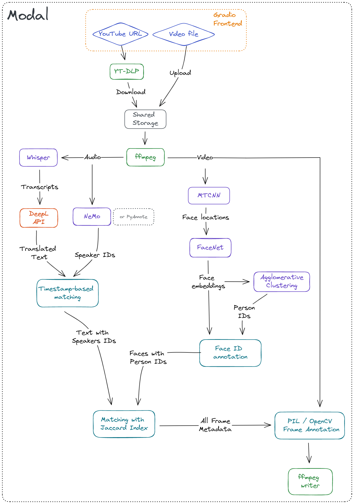
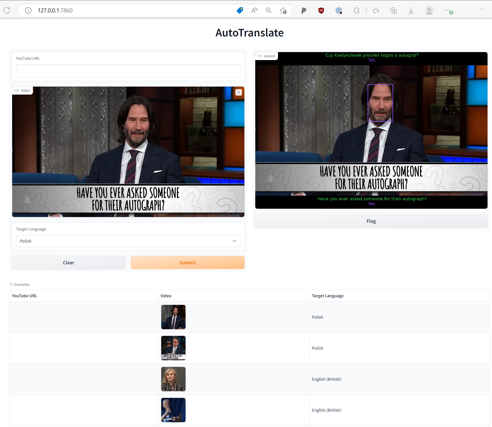
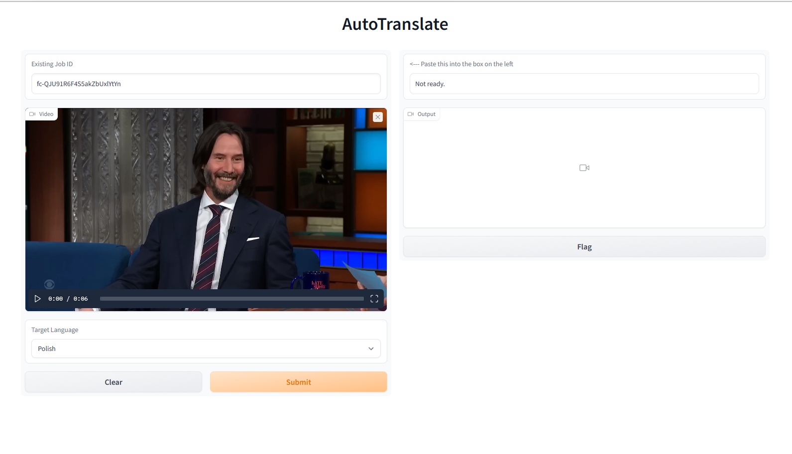

# 1. Introduction

# 1.1 The main idea

I finally got around to play [Cybperunk 2077](https://www.gog.com/en/game/cyberpunk_2077) the other day, and I noticed that the game has one interesting feature: 

when a character speaks a foreign language, the text first appears above them in the original form, and then gets sort of live-translated into English.

I've then asked myself: how much work would it take to build something like that with modern DL stack? Is it possible to do it over a weekend? 

<p align="center">
    
</p>

## 1.2 The rough requirements

I wanted to have a system which would
- Process short video clips (e.g. a single scene)
- Work with multiple characters / speakers
- Detect and transcribe speech in both English and Polish
- Translate the speech to any language
- Assign each phrase to a speaker
- Show the speaker on the screen 
- Add subtitles to the original video in a way mimicking the Cyberpunk example
- Have a nice frontend
- Run remotely in the cloud

## 1.3 The TL;DR

With the amazing ML ecosystem we have today, it's definatelly possible to build a PoC of a system like that in a couple of evenings. 

The off-the-shelf tools are quite roboust, and mostly extremely easy to integrate. What's more, the abundance of pre-trained models meant that I could build the whole app without running a single gradient update, or hand-labeling a single example.

As for the timelines -- it definatelly took me more time than I anticipated, but actually most of the time was spent on non-ML issues (like figuring out how to add Unicode characters to a video frame).

Here's a 60s clip of an interview conducted in Polish, translated to English. You can see that we a very clean setup like this, the results actually look quite OK!

https://user-images.githubusercontent.com/10772830/208771745-37e64474-438b-418d-a99b-58c11657d5f2.mp4

And here's a part of an interview with Keanu Reeves (who plays a major character in Cyberpunk 2077) talking to Steven Colbert, translated to Polish.

Note that in this case the speaker diarization is not perfect, and the speaker IDs get mixed up for a moment mid-video:

https://user-images.githubusercontent.com/10772830/208771178-632b180a-231e-4a77-b578-f18cd23c3697.mp4


# 2. Implementation 

I glued together a couple of tools to make this thing fly:
- [ffmpeg-python](https://github.com/kkroening/ffmpeg-python) for processing the video files (e.g. extracting audio, streaming raw frames)
- [Whisper](https://github.com/openai/whisper) for speech recognition
- [NVIDIA NeMo](https://github.com/NVIDIA/NeMo) for speaker diarization (note: I also tested [PyAnnote](https://github.com/pyannote), but the results were not satisfactory)
- [DeepL](https://github.com/DeepLcom/deepl-python) for translation
- [RetinaFace](https://github.com/serengil/retinaface) for face detection
- [DeepFace](https://github.com/serengil/deepface) for face embedding
- [scikit-learn](https://scikit-learn.org/stable/modules/generated/sklearn.cluster.AgglomerativeClustering.html) for detecting unique faces (via clustering)
- [Gradio](https://github.com/gradio-app/gradio) for a nice demo frontend
- [Modal](https://modal.com/) for serverless deployment 

There's also [PIL](https://github.com/python-pillow/Pillow) & [OpenCV](https://github.com/opencv/opencv-python) used to annotate the video frames, and [yt-dlp](https://github.com/yt-dlp/yt-dlp) to download samples from YT.

Here's a sketch of how these things work together to produce the final output:

<p align="center">
    
</p>

## 2.1 Handling the speech

Extracting audio from a `webm` / `mp4` is trivial with `ffmpeg` 

```python
def extract_audio(path: str, path_out: Optional[str] = None):
    """Extract audio from a video file using ffmpeg"""

    audio = ffmpeg.input(path).audio
    output = ffmpeg.output(audio, path_out)
    output = ffmpeg.overwrite_output(output)
    ffmpeg.run(output, quiet=True)

    return path_out
```

Once we have the sound extracted, we can process it with:

### 2.1.1 Whisper

<p align="center">
    
</p>

There isn't much to say about [Whisper](https://github.com/openai/whisper), really. 

It's a fantastic tool, which recognizes english speach better than me.

It handles mutliple languages, and works okay even with overlapping speech.

I've decided to feed the whole audio stream to `whisper` as a single input, but if you wanted to improve this part of the code, you could experiment with partitioning the audio for each speaker, but my bet is that this will not give any better results. 

### 2.1.2 DeepL


I could use a pre-trained Neural Machine Translation model here (or use `Whisper`, since it also does translation), but I wanted to get the highest quality possible. 

In my experience, [DeepL](https://www.deepl.com/) works better than Google Translate, and their API gives you 500k characters / month for free. 

They also provide a convenient python interface.

To improve this part of the code one could try to translate the text from each speaker separately, maybe then the translation would be even more coherent? But this would strongly depend on our ability to accurately assign the phrases to speakers.

### 2.1.3 Speaker Diarization -- NeMo and PyAnnote

Speaker diarization is a process assigning speaker IDs to each time point in the audio signal. 

<p align="center">
    

#### 2.1.3.1 PyAnnote

I initially used [PyAnnote](https://github.com/pyannote) for this purpose, since it's available on `HuggingFace` and extremely straightforward to integrate into your codebase:

```python
pipeline = Pipeline.from_pretrained(
    "pyannote/speaker-diarization@2.1.1",
    use_auth_token=auth_token,
    cache_dir=cache_dir,
)

dia = pipeline(path_audio)
```

Unfortunately the quality was not really satisfactory, and errors in this part of the pipeline were hurting all of the downstream steps.

#### 2.1.3.2 NeMo

I then turned to [NeMo](https://github.com/NVIDIA/NeMo), from good folks at `NVIDIA`. 

In their words: "NVIDIA NeMo is a conversational AI toolkit built for researchers working on automatic speech recognition (ASR), text-to-speech synthesis (TTS), large language models (LLMs), and natural language processing (NLP)."

I found it to be quite reliable, especially for english. It still struggles with short segments of overlapping speech, but it's definatelly good enough for the demo. 

The biggest downside is that `NeMo` is a research toolkit. Therefore simple tasks like "give me unique IDs for this audio file" result in a code that is much more messy than the `PyAnnote` version. 

Note that I mainly tested it on rather high-quality, interview-type audio. I do not know how this would translate to other scenarios or very different languages (e.g. Japanese).

### 2.1.4 Matching speaker IDs to spoken phrases

I used a simple heuristic here, where for every section of speech (output from `NeMo`) we find the phrase detected by `Whisper` with the largest overlap. 

This part of the code could definatelly be improved with a more sofisticated approach. It would also be good to look more into the timestamps returned by the two systems, since for some reason I had an impression that an offset 

## 2.2 Handling video streams

This is pretty straightforward with `cv2` and `ffmpeg`. The main tip is that for video processing, generators are the way to go -- you probably don't want to load 1 minute video into a numpy array (`1920 * 1080 * 3 * 24 * 60` entries will take `~35GB` of RAM).

### 2.2.1 Detecting faces in video

Detecting faces is luckily super straight-forward with modern tools like `RetinaFace` or `MTCNN`. 

In this first step we run a pre-trained model to detect all faces visible in each frame.

We then crop, align, and re-size them as required by the downstream embedding model, as in this example from the [original repo](https://github.com/serengil/retinaface)

<p align="center">
    

This step is quite roboust and reliable, the only downside is that it relies on `Tensorflow`, and the code can only handle single frame at a time. 

It's quite time-consuming to run this detection for every frame in a video, so this part of the code could definatelly use some optimizations.

With a modern GPU it takes several minutes to process ~60s of video.

Luckily, with `Modal` we can use massive parallelization, so the runtime is shorter, even if processing happens on single-CPU machines.

### 2.2.2 Embedding faces and assigning them unique IDs

Once we've located faces in each frame, we can use a pre-trained model to extract embeddings for each of them.

For this I've grabbed the `FaceNet512` model from [DeepFace](https://github.com/serengil/deepface) library.

Once embeddings are extracted, we still need to assign them unique IDs. 
To do this, I went with a simple hierarchical clustering algorithm (or specifically, [Agglomerative Clustering](https://scikit-learn.org/stable/modules/generated/sklearn.cluster.AgglomerativeClustering.html#sklearn.cluster.AgglomerativeClustering) from `scikit-learn`)

Agglomerative Clustering will recursively merge clusters as long as the distance between them is below a certain threshold. That threshold is model- and metric-specific. Here I used same value which is used by `DeepFace` when performing "face verification".

This part of the code could be improved in many ways:

- Improve the clustering algorithm by either
    - Using a different algorithm (e.g. DBSCAN)
    - Using more domain knowledge (e.g. the fact that faces with similar locations in consecutive frames are likely to be the same person, no two faces in a single frame can be a single person etc.)
- Investigate if it would be a good idea to identify a couple of "best" frames where the face is in the best position, and use them as a tempalte.
- Enforce temporal consistency -- predictions should not be made for each frame in isolation. 
- Improve the embeddings themselves, e.g. by using a combination of models, or different distance metrics?

Here's a visual representation of how the Agglomerative Clustering works -- by changing the threshold (cutoff on the Y-axis) you will end up with different number of clusters.

<p align="center">
    

### 2.2.3 Matching Face IDs to Speaker IDs 

For this we employ another simple heuristic: for each face, we create a set of frames where that face was detected. 

We then do the same for speakers -- create a set of frames where a given speaker can be heard. 

Now, for each face ID we find the speaker ID for which Jaccard index between the two sets is minimized.

### 2.2.4 Generating the frames

Once we have annotated every frame with a speaker ID, face ID, phrase in original language, and phrase in the translated language -- we can finally add subtitles.

Even though our system does not work in real time, I wanted to give it a similar look to the Cyberpunk example -- so as a last processing step I calculate how many characters from a recognized phrase should be displayed on the frame.

What remains now is to figure out how to place the subtitles such that they fit on the screen etc.

This part of the code could be improved to handle more languages. To place UTF-8 characters on the screen, I need to explicitly pass a path to a font file to `PIL`. The problem is that different languages require different fonts, so the current solution won't work e.g. for Korean.

## 2.3 Deployment

### 2.3.1 Gradio frontend

Last thing I wanted to check is how easy it is to deploy this system on a cloud platform.

Getting the frontend ready can be trivially done with [Gradio](https://gradio.app/docs/). 

<p align="center">
    
</p>

### 2.3.2 Serverless backend with Modal and FastAPI

We could try to deploy the model with [Huggingface Spaces](https://huggingface.co/docs/hub/spaces-sdks-gradio), but I wanted to try something a bit more "production-ready".

I wen't ahead with [Modal](https://modal.com/) -- a serverless platform built by [Erik Bernhardsson](https://erikbern.com/) and his team. You can read more about it [in his blogpost](https://erikbern.com/2022/12/07/what-ive-been-working-on-modal.html)

`Modal` is really appealing since it allows me to write the code exactly how I imagined the programming for the cloud should look like. What locally you'd write as:

```python
def run_asr(audio_path: str):
    return whisper.transcribe(audio_path)


def process_single_frame(frame: np.ndarray, text: str):
    frame = add_subtitles(frame, text)
    return frame
```

With `Modal` becomes

```python
@stub.function(image=gpu_image, gpu=True)
def run_asr(audio_path: str):
    return whisper.transcribe(audio_path)


@stub.function(image=cpu_image)
def process_single_frame(frame: np.ndarray, text: str):
    frame = add_subtitles(frame, text)
    return frame
```

So with minimal boilerplate we now have a code that can run remotely **within seconds**. Pretty wild.

There are obviously still some rough edges (`Modal` is still in beta), and I had to work around one last issue: when running a `FastAPI` app, there is a 45 second limit for each request. And since processing a video takes a bit longer, I used a not-so-nice workaround, where pressing `Submit` for the first time gives you the job id, and you can use that id to fetch the final result:

<p align="center">
    
</p>

# Limitations

This is very obviously just a demo / proof-of-concept!

The main limitations are:
- Processing 30s of video takes several minutes on a modern PC
- The approach used here will not work well for clips with multiple scenes
- Matching faces to voices relies on simple co-occurence heuristic, and will not work in certain scenarios (e.g. if the whole conversation between two people is recorded from a single angle)
- All the steps of the pipeline rely on imperfect tools (e.g. diarization) or simplistic heuristics (e.g. finding unique faces with agglomerative clustering)
- The pipeline was only tested on a handful of examples

# Development

## With Modal

First of all, you'll need a `Modal` account, see https://modal.com/

You'll then need to add your `HuggingFace` (`HUGGINGFACE_TOKEN`) and `DeepL` (`DEEPL_KEY`) authentication tokens as `Secret`s in `Modal` dashboard. 

Once this is set up, you should be able to simply run:

```
python -m venv ./venv
source ./venv/bin/activate
python -m pip install -r requirements-modal.txt
```

You can then run it with

```
python cbp_translate/app.py
```

## Locally

First, export the necessary env variables:

```bash
export DEEPL_KEY="..."
export HUGGINGFACE_TOKEN="..."
export MODAL_RUN_LOCALLY=1
```

Then, it's best if you look at the steps defined in `cbp_translate/modal_/remote.py`

Roughly, it goes something like this:

```bash
# Apt
sudo apt install ffmpeg libsndfile1 git build-essential

# We skip conda steps, assuming you have cuda and cudnn installed 
echo "Skipping CUDA installation"

# pip
python -m venv ./venv
source ./venv/bin/activate
python -m pip install --upgrade pip setuptools
python -m pip install -r requirements-local.txt

# Install the package for development
python setup.py develop
```

Run the CLI:

```bash
python 

python cbp_translate/cli.py \
    --path-in ./assets/videos/keanu-reeves-interview.mp4 \
    --path-out ./translated.mp4 \
    --language PL
```

# Note on git-lfs

There are several large files included in this repo, which are stored using `git-lfs`.

To clone the repo without downloading the large files, run:

```bash
GIT_LFS_SKIP_SMUDGE=1 git clone ...
```
