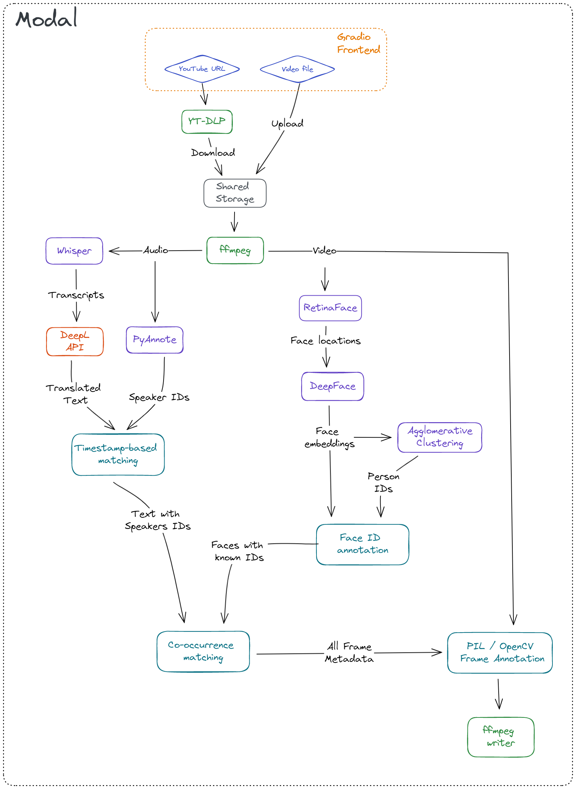
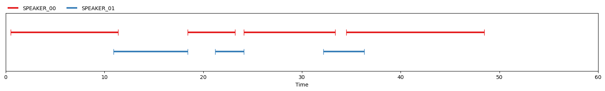

# The premise

I finally got around to play Cybperunk 2077 the other day, and I noticed that the game had one interesting feature: 

when a character would speak a foreign language, the text would first appear above them in the original form, and then get sort of live-translated into English.

I've then asked myself: how much work would it take to build something like that with modern DL stack? Is it possible to do it over a single weekend? 

<p align="center">
    
</p>

# The rough idea

I wanted to have a system which would process short video clips. It should
- Work with multiple characters / speakers
- Work with multiple camera angles
- Detect and transcribe speech in any language
- Translate the speech to any language
- Assign each phrase to a speaker
- Show the speaker on the screen 
- Add subtitles to the original video in a way mimicking the Cyberpunk example


# The TL;DR

It's defintielly possible to build a PoC of a system like that in 1-2 days thanks to amazing deep learning ecosystem we have today. 

However, when it comes to functionality, the off-the-shelf solutions do not yet have a perfect accuracy. Most notably, detecting unique speakers does not work well out of the box, and detecting unique faces require something more than crude clustering used here.

And when it comes to timelines -- it took me a couple more evenings to sort out boring things like generating subtitles with `PIL` or figuring out how to deploy it in a serverless manner.  

Here's a 30s sample of Keanu Reeves (who plays a major character in CBP 2077) talking to Steven Colbert, translated to Polish. 

You can see that there is couple of issues here: both voice assignment and face assignment could use some improvement! Voice recognition and translation are top notch, though! 

<p align="center">
    
</p>

# Implementation 

I glued together a couple of tools to make this thing fly:
- [ffmpeg-python](https://github.com/kkroening/ffmpeg-python) for processing the video files (e.g. extracting audio, streaming raw frames)
- [Whisper](https://github.com/openai/whisper) for speech recognition
- [PyAnnote](https://github.com/pyannote) for speaker diarization
- [DeepL](https://github.com/DeepLcom/deepl-python) for translation
- [RetinaFace](https://github.com/serengil/retinaface) for face detection
- [DeepFace](https://github.com/serengil/deepface) for face embedding
- [scikit-learn](https://scikit-learn.org/stable/modules/generated/sklearn.cluster.AgglomerativeClustering.html) for detecting unique faces
- [Gradio](https://github.com/gradio-app/gradio) for a nice demo frontend
- [Modal](https://modal.com/) for serverless deployment 

There's also [PIL](https://github.com/python-pillow/Pillow) & [OpenCV](https://github.com/opencv/opencv-python) used to annotate the video frames, and [yt-dlp](https://github.com/yt-dlp/yt-dlp) to download samples from YT.

Here's a sketch of how these things work together to produce the final output:

<p align="center">
    
</p>

## Handling the speech

Extracting audio from a `webm` / `mp4` is trivial with `ffmpeg` 

```python
def extract_audio(path: str, path_out: Optional[str] = None):
    """Extract audio from a video file using ffmpeg"""

    audio = ffmpeg.input(path).audio
    output = ffmpeg.output(audio, path_out)
    output = ffmpeg.overwrite_output(output)
    ffmpeg.run(output, quiet=True)

    return path_out
```

Once we have the sound extracted, we can process it with:

### Whisper

<p align="center">
    
</p>

There isn't much to say about `Whisper`, really. 

This is a fantastic tool, which recognizes english speach better than me.

It handles mutliple languages, and works okay even with overlapping speech.

I've decided to feed the whole audio stream to `whisper` as a single input. 


If you wanted to improve this part of the code, you could experiment with partitioning the audio for each speaker, but my bet is that this will not give any better results. 

### DeepL


I could use a pre-trained Neural Machine Translation model here (or use `Whisper`, since it also does translation), but I wanted to get the highest quality possible. 

In my experience, [DeepL](https://www.deepl.com/) works better than Google Translate, and their API gives you 500k characters / month for free. 

They also provide a convenient python API.

To improve this part of the code one could try to translate the text from each speaker separately, maybe then the translation would be even more coherent? But this would strongly depend on our ability to accurately assign the phrases to speakers.

### PyAnnote

I used `PyAnnote` for speaker diarization. It's a convenient way to detect unique speaker IDs for a given audio input: 

<p align="center">
    

But I have to say, this is by far the weakest part of the pipeline.

Even in English it makes lots of mistakes (both assigning the same ID to multiple speakers, as well as multiple IDs to a single speaker), and doesn't handle short phrases (e.g. interruptions during an interview).

It also doesn't work well with other languages (which is kind of important for a translation system). But obviously it's kind of understandable -- the model was trained only on english. 

This part of the code could use a lot of improvements, the first and most obvious would be to explore other diarization approaches. 

But given all of these problems I still need to give kudos to the `PyAnnote` author: it's by far the easiest deep model to use for this problem:

```python
pipeline = Pipeline.from_pretrained(
    "pyannote/speaker-diarization@2.1.1",
    use_auth_token=auth_token,
    cache_dir=cache_dir,
)

dia = pipeline(path_audio)
```

### Matching speaker IDs to spoken phrases

I used a simple heuristic here, where for every section of speech (output from `PyAnnote`) we find the phrase detected by `Whisper` with the largest overlap. 

This part of the code could definatelly be improved with a more sofisticated approach. It would also be good to look more into the timestamps returned by the two systems, since for some reason I had an impression that an offset 

## Handling video streams

This is pretty straightforward with `cv2` and `ffmpeg`. The main tip is that for video processing, generators are the way to go -- you probably don't want to load 1 minute video into a numpy array (`1920 * 1080 * 3 * 24 * 60` entries will take `~35GB` of RAM).

### Detecting faces in video

Detecting faces is luckily super straight-forward with modern tools like `RetinaFace`. 

In this first step we run a pre-trained model to detect all faces visible in each frame, and then select top 3 largest ones.

We then crop, align, and re-size them as required by the downstream embedding model, as in this example from the [original repo](https://github.com/serengil/retinaface)

<p align="center">
    

This step is roboust and reliable, the only downside is that it relies on `Tensorflow`, and the code can only handle single frame at a time. 

It's quite time-consuming to run this detection for every frame in a video, so this part of the code could definatelly use some optimizations.

With a modern GPU it takes ~2 minutes minutes to process ~60s of video.

With `Modal` we can use massive parallelization, so the runtime is shorter, even if processing happens on single-CPU machines.

### Embedding faces and assigning them unique IDs

Once we've located faces in each frame, we can use a pre-trained model to extract embeddings for each of them.

For this I've grabbed the `ArcFace` model from [DeepFace](https://github.com/serengil/deepface) library.

Once embeddings are extracted, we still need to assign them unique IDs. 
To do this, I went with a simple hierarchical clustering algorithm (or specifically, [Agglomerative Clustering](https://scikit-learn.org/stable/modules/generated/sklearn.cluster.AgglomerativeClustering.html#sklearn.cluster.AgglomerativeClustering) from `scikit-learn`)

Agglomerative Clustering will recursively merge clusters as long as the distance between them is below a certain threshold. That threshold is model- and metric-specific. Here I used same value which is used by `DeepFace` when performing "face verification".

This part of the code could be improved in many ways:

- Improve the clustering algorithm by either
    - Using a different algorithm (e.g. DBSCAN)
    - Using more domain knowledge (e.g. the fact that faces with similar locations in consecutive frames are likely to be the same person, no two faces in a single frame can be a single person etc.)
- Investigate if it would be a good idea to identify a couple of "best" frames where the face is in the best position, and use them as a tempalte.
- Enforce temporal consistency -- predictions should not be made for each frame in isolation. 
- Improve the embeddings themselves, e.g. by using a combination of models, or different distance metrics?

Here's a visual representation of how the Agglomerative Clustering works -- by changing the threshold (cutoff on the Y-axis) you will end up with different number of clusters.

<p align="center">
    

### Matching Face IDs to Speaker IDs 

For this we employ another simple heuristic: we simply check which speaker-IDs and face-IDs co-occur most often. Again, this could be improved with a more sofisticated approach.

### Generatign the frames

Once we have annotated every frame with a speaker ID, face ID, phrase in original language, and phrase in the translated language -- we can finally add subtitles.

Even though our system does not work in real time, I wanted to give it a similar look to the Cyberpunk example -- so as a last processing step I calculate how many characters from a recognized phrase should be displayed on the frame.

What remains now is to figure out how to place the subtitles such that they fit on the screen etc.

## Deployment

Last thing I wanted to check is how easy it is to deploy this system on a cloud platform.

Getting the frontend ready can be trivially done with [Gradio](https://gradio.app/docs/). 

< SCREEN SHOT >

We could try to deploy the model with [Gradio Spaces](https://huggingface.co/docs/hub/spaces-sdks-gradio), but I wanted to try something a bit more "production-ready".

I wen't ahead with [Modal](https://modal.com/) -- a serverless platform built by [Erik Bernhardsson](https://erikbern.com/) and his team. You can read more about it [in his blogpost](https://erikbern.com/2022/12/07/what-ive-been-working-on-modal.html)

`Modal` is really appealing since it allows me to write the code exactly how I imagined the programming for the cloud should look like. What locally you'd write as:

```python
def run_asr(audio_path: str):
    return whisper.transcribe(audio_path)


def process_single_frame(frame: np.ndarray, text: str):
    frame = add_subtitles(frame, text)
    return frame
```

With `Modal` becomes

```python
@stub.function(image=gpu_image, gpu=True)
def run_asr(audio_path: str):
    return whisper.transcribe(audio_path)


@stub.function(image=cpu_image)
def process_single_frame(frame: np.ndarray, text: str):
    frame = add_subtitles(frame, text)
    return frame
```

So with minimal boilerplate we now have a code that can run remotely **within seconds**. Pretty wild.

So after decorating a couple of functions we can finally press `run`, and of it goes:

The app is currently not running, as both `Modal` and `DeepL` are paid services, and this is clearly not a project which I could monetize. 

# Development

If you'd like to run the code yourself, you'll need
- HuggingFace token
- DeepL token
- Modal token

Once you've got these things set up (HF and DeepL tokens need to be added to Modal dashboard as Secrets), you can simply run

```
python -m venv ./venv
source ./venv/bin/activate
python -m pip install -r requirements.txt
python cbp_translate/app.py
```
